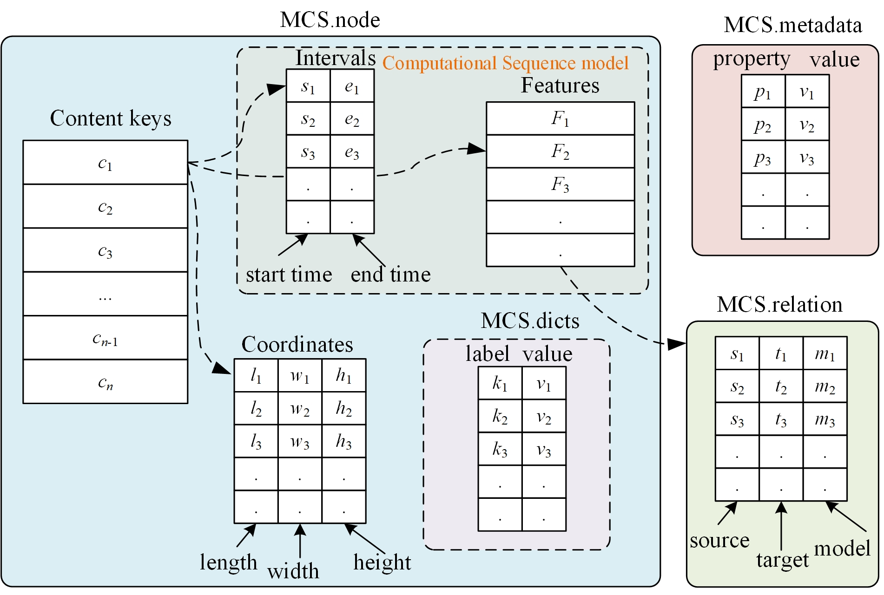
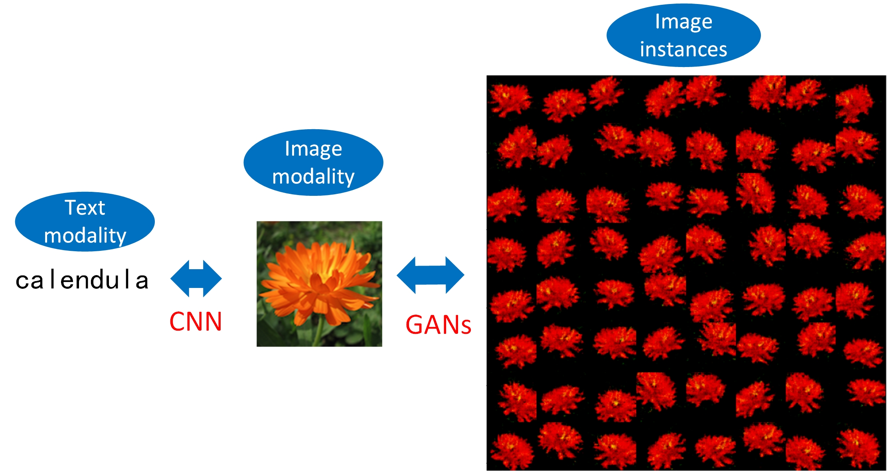

# MMKit-Features: Multimodal Feature Extraction Toolkit

Traditional knowledge graphs (KGs) are usually comprised of entities, relationships, and attributes. However, they are not designed to effectively store or represent multimodal data. This limitation prevents them from capturing and integrating information from different modes of data, such as text, images, and audio, in a meaningful and holistic way.

The `MMKit-Features` project proposes a multimodal architecture to build multimodal knowledge graphs with flexible multimodal feature extraction and dynamic multimodal concept generation. 

## Project Goal
- To extract, store, and fuse various multimodal features from multimodal datasets efficiently;
- To achieve generative adversarial network(GAN)-based multimodal knowledge representation dynamically in multimodal knowledge graphs;
- To provide a common deep learning-based architecture to enhance multimodal knowledge reasoning in real life. 

## Installation

You can install this toolkit using our [PyPi](https://pypi.org/project/mmkit-features/) package. 

```
    pip install mmkit-features
```

## Design Science Framework



Figure 1: Multimodal Computational Sequence



Figure 2: GAN-based Multimodal Concpet Generation

## Modalities

1. Text/Language modality
2. Image modality
3. Video modality
4. Audio modality
5. Cross-modality among above

## Usage
A toy example showing how to build a multimodal feature (MMF) library is here:

```python
from mmkfeatures.fusion.mm_features_lib import MMFeaturesLib
from mmkfeatures.fusion.mm_features_node import MMFeaturesNode
import numpy as np
if __name__ == "__main__":
    # 1. create an empty multimodal features library with root and dataset names
    feature_lib = MMFeaturesLib(root_name="test features",dataset_name = "test_features")
    # 2. set short names for each dimension for convenience
    feature_lib.set_features_name(["feature1","feature2","feature3"])
    # 3. set a  list of content IDs
    content_ids = ["content1","content2","content3"]
    # 4. according to IDs, assign a group of features with interval to corresponding content ID
    features_dict = {}
    for id in content_ids:
        mmf_node = MMFeaturesNode(id)
        mmf_node.set_item("name",str(id))
        mmf_node.set_item("features",np.array([[1,2,3]]))
        mmf_node.set_item("intervals",np.array([[0,1]]))
        features_dict[id] = mmf_node
    # 5. set the library's data
    feature_lib.set_data(features_dict)
    # 6. save the features to disk for future use
    feature_lib.save_data("test6_feature.csd")
    # 7. check structure of lib file with the format of h5py
    feature_lib.show_structure("test6_feature.csd")
    # 8. have a glance of features content within the dataset
    feature_lib.show_sample_data("test6_feature.csd")
    # 9. Finally, we construct a simple multimodal knowledge base. 
```

Further instructions on the toolkit refers to [here](https://github.com/dhchenx/mmkit-features/tree/main/doc). 


## Applications

Here are some examples of using our work in real life with codes and documents. 

### 1. Multimodal Features Extractors

- [Text Features Extraction](doc/text_features_extraction.md)
- [Speech Features Extraction](doc/speech_features_extraction.md)
- [Image Features Extractoin](doc/image_features_extraction.md)
- [Video Features Extraction](doc/video_features_extraction.md)
- [Transformer-based Features Extraction](src/mmkfeatures/transformer/README.md)

### 2. Multimodal Feature Library (MMFLib)

- [Basic Computational Sequence](doc/simple_computational_seq_use.md)
- [Core use of MMFLib](doc/multimodal_features_library.md)

### 3. Multimodal knowledge bases

- [Multimodal Birds Feature Library](doc/example_bird_library.md)
- [Multimodal Disease Coding Feature Library](doc/example_icd11_library.md)
- [Multimodal ROCO Feature Library](examples/roco_lib/step1_create_lib_roco.py)

### 4. Multimodal Indexing and Querying

- [Brute Force Indexing](examples/birds_features_lib/step3_use_index.py)
- [Inverted Indexing](examples/birds_features_lib/step3_use_index.py)
- [Positional Indexing](examples/birds_features_lib/step3_use_index.py)
- [Multimodal Indexing and querying](examples/birds_features_lib/evaluate/)

## Credits

The project includes some source codes from various open-source contributors. Here is a list of their contributions. 

1. [A2Zadeh/CMU-MultimodalSDK](https://github.com/A2Zadeh/CMU-MultimodalSDK)
2. [aishoot/Speech_Feature_Extraction](https://github.com/aishoot/Speech_Feature_Extraction)
3. [antoine77340/video_feature_extractor](https://github.com/antoine77340/video_feature_extractor)
4. [jgoodman8/py-image-features-extractor](https://github.com/jgoodman8/py-image-features-extractor)
5. [v-iashin/Video Features](https://v-iashin.github.io/video_features/)

## License

The `mmkit-features` project is provided by [Donghua Chen](https://github.com/dhchenx) with MIT license. 

## Citation

Please cite our project if the project is used in your research. 

Chen, D. (2023). MMKit-Features: Multimodal Features Extraction Toolkit (Version 0.0.2) [Computer software]

