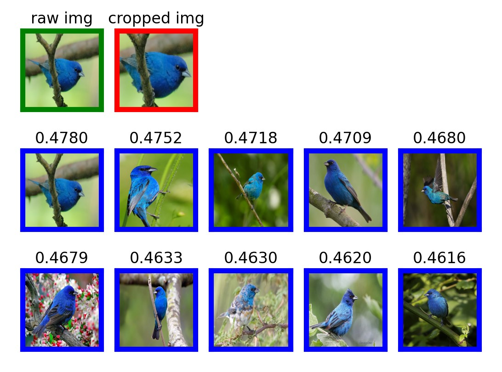

## Transformer-based Feature Extraction

We also integrate the state-of-the-art Transformer-based methods to extract features based on a series of large-scale pretrained models. 

### Examples

1. Text-based Transformer-based feature extraction using [Transformer-XL](https://huggingface.co/transfo-xl-wt103). 

```python
from mmkfeatures.transformer.text.model import *
'''
    Example to show the use of Transformer-based text feature extractor
'''
if __name__=="__main__":
    root_folder = "datasets/text1"
    input_text = "lung cancer"
    start = time.time()
    fe=TransformerTextFeatureExtractor(model_or_path="transfo-xl-wt103",
                                       data_path=f'{root_folder}/data1.csv',
                                       feature_data_path=f'{root_folder}/feature_list1.npy',
                                       max_num=100)
    print("creating...")
    fe.create()
    d1=time.time()-start
    start=time.time()
    print("loading...")
    fe.load()
    d2 = time.time() - start
    start = time.time()
    print("searching...")
    fe.search(input_text=input_text)
    d3 = time.time() - start
    start = time.time()
    print("d1=",d1)
    print("d2=",d2)
    print("d3=",d3)

```

2. Image-based Transformer-based feature extraction based on [Swin Transformer](https://github.com/microsoft/Swin-Transformer). 

```python
from mmkfeatures.transformer.image.utils import *
from mmkfeatures.transformer.image.model import *
if __name__ == '__main__':
    '''
    Example to show the use of Swin Transformer-based Methods to extract image features
    '''
    root_path="datasets/image1"
    # 1. open image and select interested region
    # path = filedialog.askopenfilename()
    search_image_path = fr'{root_path}/sample2.jpg'
    roisor = ROISelector(search_image_path)
    plt.show()
    ori_img = roisor.img
    roi = roisor.cropped_img
    print(roi)

    ife=TransformerImageFeatureExtractor(db_data_path=f'{root_path}/DB.npz',
                                     data_image_path=f'{root_path}/cub_data/images',
                                     config_file=f'{root_path}/swin_tiny_patch4_window7_224.yaml',
                                     checkpoints_file=f'{root_path}/swin_tiny_patch4_window7_224.pth')
    # 2. Start to search
    ife.search(roi,show_fig=True)


```



3. Transformer-based Audio Feature Extractor

```python
from mmkfeatures.transformer.audio.model import *

if __name__=="__main__":
    audio_path="taken_clip.wav"
    audioFE=TransformerAudioFeatureExtractor()
    logits=audioFE.extract_features(audio_file_path=audio_path)
    transcription=audioFE.predict(logits)
    print("Transcription: ",transcription)
```

4. Transformer-based Video Feature Extractor

Step 1: Create video datasets suitable for training and testing
```python
from mmkfeatures.transformer.video.data_generator import *
if __name__=="__main__":
    vd=VideoDatasets(root_folder='ucf101_top5')
    vd.load_data()
    vd.generate()
    vd.save_data()
```

Step 2: Training and testing Transform-based Video Feature Extractor
```python
from mmkfeatures.transformer.video.model import *
if __name__=="__main__":
    vfe = TransformerVideoFeatureExtractor(root_folder='ucf101_top5',num_epochs=10)
    vfe.load_data()
    vfe.train()
    results=vfe.predict(test_video='ucf101_top5/test/v_CricketShot_g01_c01.avi')
    for k in results:
        print(f"{k}:{round(results[k],4)}")
```

More implementation of Transformer-based extractors are coming soon. 
